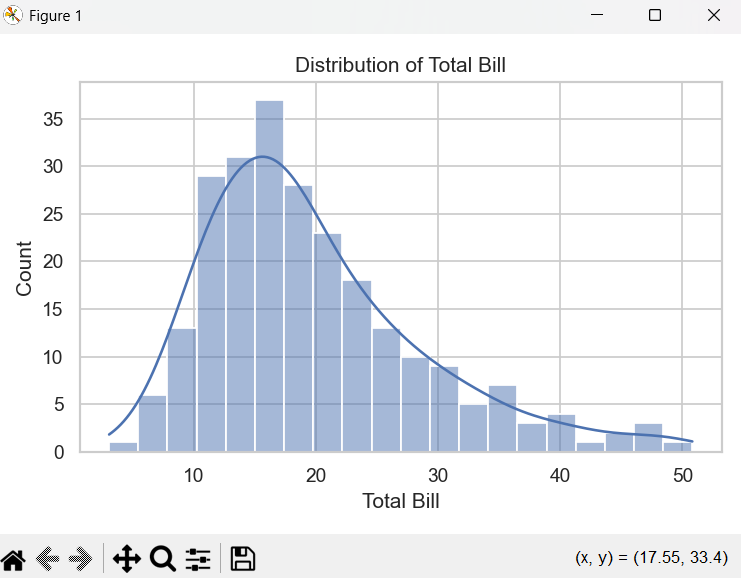
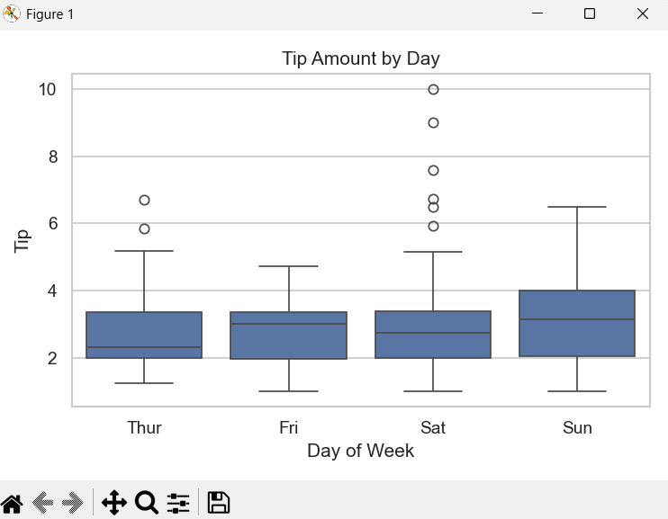
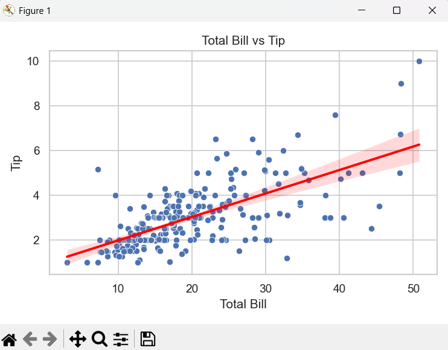
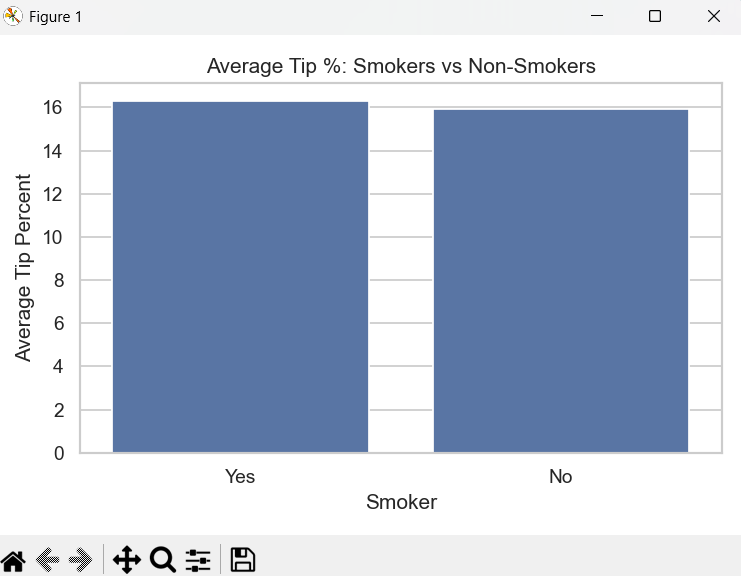
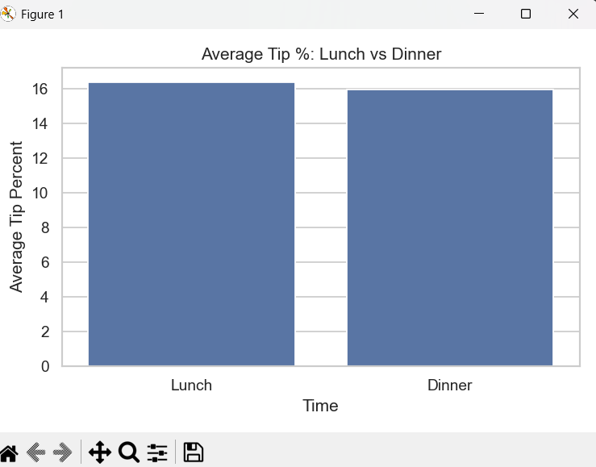

# Tips Dataset EDA

A small exploratory data analysis (EDA) project on the Seaborn **tips** dataset using NumPy, Pandas, Matplotlib, and Seaborn. It explores restaurant bills, tips, and tipping behaviour across different categories.

## Project overview

This project covers:
- Loading the Seaborn `tips` dataset into a Pandas DataFrame.
- Basic data inspection (shape, info, describe, missing values).
- Grouped statistics by sex, smoker status, day, and time.
- Visualizations of distributions, categories, and relationships.
- Feature engineering of `tip_percent` and comparisons across groups. 

## Tech stack

- Python 3.x  
- NumPy  
- Pandas  
- Matplotlib  
- Seaborn 

All dependencies are listed in `requirements.txt`.

## How to run

1. Clone the repository:

git clone https://github.com/<your-username>/<your-repo-name>.git
cd <your-repo-name>

2. Create and activate a virtual environment (optional but recommended):

python -m venv venv
venv\Scripts\activate # Windows

3. Install dependencies:

pip install -r requirements.txt

4. Run the script:

python tips_eda.py

The script prints summary statistics to the terminal and displays the plots.

## Analysis steps

The analysis performs the following steps:

- **Data loading and inspection**
- Load `tips` via `seaborn.load_dataset("tips")`.
- Inspect `shape`, `info()`, `describe()`, and missing values. 

- **Grouped statistics**
- Mean `total_bill` and `tip` by `sex`, `smoker`, and `day`.
- Average `tip_percent` by `smoker` and by `time` (lunch vs dinner).
- **Visualizations**
- Histogram of `total_bill` with KDE.
- Boxplot of `tip` by `day`.
- Scatter plot with regression line for `total_bill` vs `tip`.
- Bar plots for average `tip_percent` by smoker status and by time. 

## Screenshots

## Screenshots and insights

### 1. Total bill distribution

Most total bills fall roughly between 10 and 20 units, with relatively few very small or very large bills. This indicates a typical spending range for most customers around that mid‑range. 

---

### 2. Tip amount by day

The median tip appears highest on Sunday, and both Saturday and Sunday show a wider spread of tips with more high-value outliers. This suggests weekends, especially Sunday, tend to have larger or more generous tipping.

---

### 3. Total bill vs tip with regression

There is a clear positive relationship between total bill and tip, as shown by the upward-sloping regression line. Higher bills are generally associated with higher tips, although the spread indicates variability in individual tipping behavior. 

---

### 4. Average tip percentage by smoker status

Smokers show a slightly higher average tip percentage compared to non‑smokers in this dataset. The difference is not huge but suggests smokers may tip a bit more relative to their bill size on average.

---

### 5. Average tip percentage by time (lunch vs dinner)

Lunch has a higher average tip percentage than dinner, even though dinner bills may be larger in absolute terms. This indicates lunch customers tend to leave a bigger share of their bill as tips compared to dinner customers.

## Dataset

The project uses the built‑in **tips** dataset from Seaborn, which contains restaurant bills and tips with information about:
- Total bill and tip.
- Gender and smoker status of the payer.
- Day of the week and time (lunch/dinner).
- Party size. 
